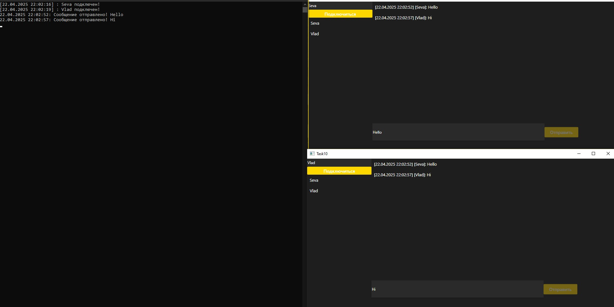

<h1 align="center">Задание 10. Разработка онлайн-чата</h1>

  

    Клиент-серверное чат-приложение с возможностями:
    <ul>
      <li>Обмена текстовыми сообщениями в реальном времени</li>
      <li>Поддержка множества одновременных пользователей</li>
      <li>Интуитивно понятный WPF-интерфейс</li>
    </ul>
  

  

    <strong>Инструкция по запуску:</strong>
    <ol>
      <li>Запустить серверную часть "ChatServer.exe"</li>
      <li>Каждый пользователь запускает клиент "Chat.exe"</li>
    </ol>
  

  

